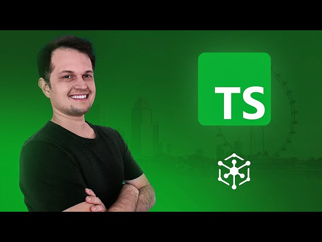

# CURSO DE TYPESCRIPT NA PRÁTICA
Curso básico de TypeScript, através do Youtube
> >## [🔗 Canal Hora de Codar!](https://www.youtube.com/@MatheusBattisti)

- ### [🔗 Dá uma olhada no curso!](https://www.youtube.com/watch?v=lCemyQeSCV8&t=3037s&ab_channel=MatheusBattisti-HoradeCodar)

### Para desenvolver em TypeScript:
- Sendo um superset de JavaScript, se faz necessário o uso do Node.js
> Você pode verificar se você tem o Node instalado com o seguinte comando:
- `node -v`
#### Usamos agora o `npm` para instalação do TypeScript
> Você pode verificar se está tudo ok e instalado com o npm com o seguinte comando:
- `npm -v`

> Agora digite no terminal:
- `npm i -g typescript`

##### Você pode verificar se deu tudo certo com o comando:
- `tsc -v`

## Agora baixe o arquivo de configuração TypeScript:
- digite `tsc --init`

- Nesse arquivo .JSON que será definidos as configurações de Root do projeto e também configuração de compilação, do TypeScript para JavaScript.

> ### Redes Socias:
  
